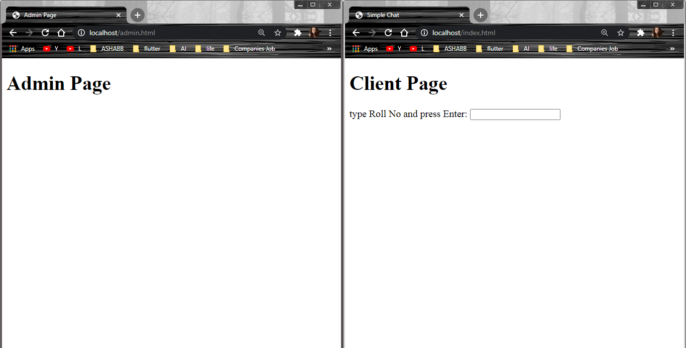
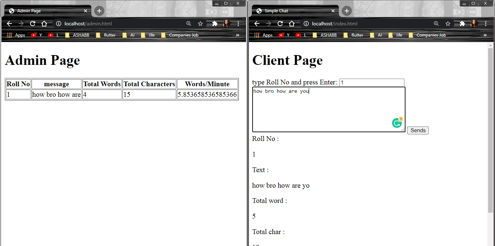
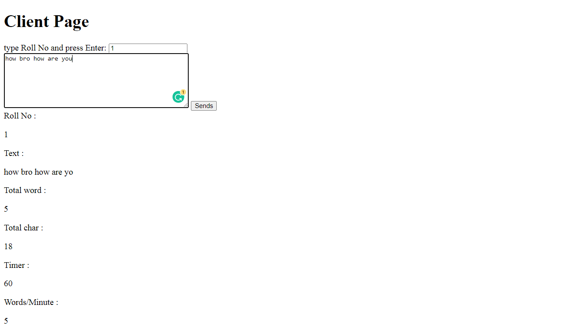
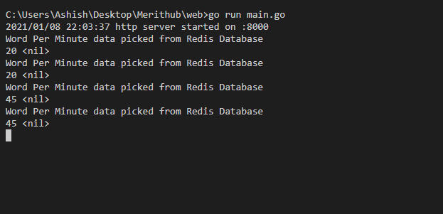

# Redis Operation Using Golang

Frontend in HTML/javascript :
The student will enter his RollNo on a screen. He will see a text area in HTML. As soon as he will start typing, your javascript code will send each word to the server through a web socket connection.

Server Side web socket connection in GoLang :
The server is a small golang code listening to a web socket and saving the data to Redis key value pair DB. You can clone it from here 

<h3>upload this 4 files to your local xampp server or other<h3>
- admin.html
- admin.js
- index.html
- index.js

<h3>start Redis Server</h3>

<h3>client side only</h3>

<h3>retrive data from Redis ky value Database : like this -> get(key)</h3>

